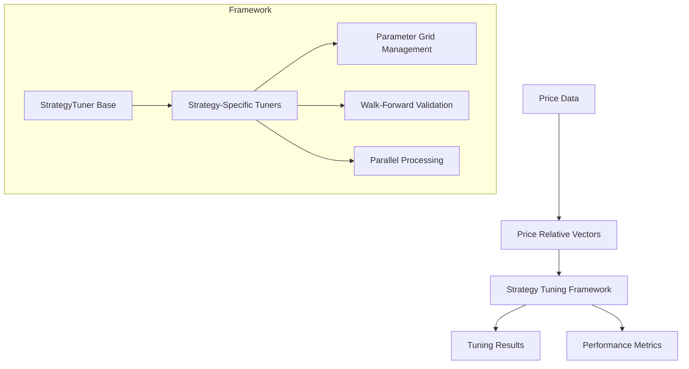
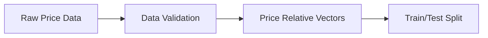
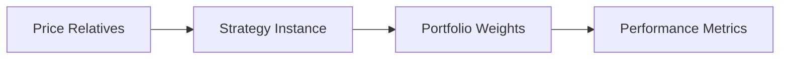
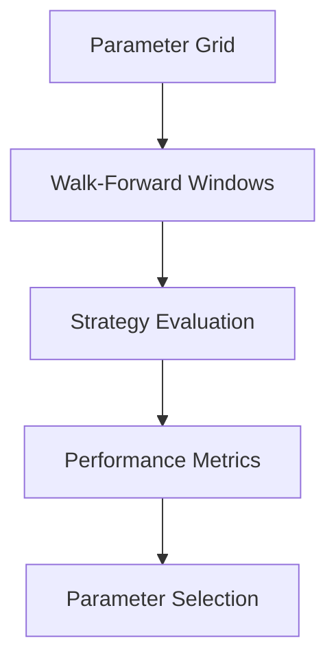

# System Architecture

This document provides a high-level overview of the system architecture and how different components interact within the framework.

## Core Components

## Component Responsibilities

### Data Pipeline
- **Price Data Processing**: Converts raw price data into price relative vectors
- **Data Validation**: Ensures data quality and format consistency
- **Test/Train Splitting**: Manages data partitioning for validation

### Strategy Framework
- **Base Strategy Interface**: Defines common strategy interface
- **Strategy Categories**:
  - Follow-the-Winner (momentum-based)
  - Follow-the-Loser (mean reversion)
  - Pattern Matching (historical similarity)
  - Meta-Learning (ensemble approaches)

### Tuning Framework
- **Base Tuner**: Core tuning functionality
- **Specialized Tuners**: Strategy-specific optimization logic
- **Parameter Management**: Grid generation and validation
- **Performance Evaluation**: Metric calculation and tracking

### Parallel Processing
- **Strategy-Level**: Parallel strategy evaluation
- **Parameter-Level**: Parallel parameter combination testing
- **Resource Management**: CPU core allocation and monitoring

## Data Flow

1. **Input Processing**

2. **Strategy Execution**

3. **Tuning Process**

## Key Design Patterns

1. **Factory Pattern**
   - StrategyFactory for creating strategy instances
   - TunerFactory for creating appropriate tuners

2. **Strategy Pattern**
   - Swappable strategy implementations
   - Consistent interface across categories

3. **Template Method**
   - Base tuning framework with customizable components
   - Strategy-specific optimization methods

4. **Observer Pattern**
   - Performance metric tracking
   - Progress monitoring

## Extension Points

### Adding New Strategies
1. Implement strategy in appropriate module
2. Add to strategy map
3. Define default parameter grid
4. Create specialized tuner (optional)

### Custom Metrics
1. Implement metric calculation
2. Add to performance evaluation
3. Update result aggregation

### Parameter Space
1. Define new parameter grid
2. Implement validation logic
3. Update grid generation

## Performance Considerations

### Memory Management
- Streaming data processing for large datasets
- Efficient parameter combination generation
- Result aggregation optimization

### CPU Utilization
- Two-level parallel processing
- Automatic core allocation
- Load balancing

### I/O Optimization
- Batched result writing
- Efficient data loading
- Progress persistence

## Error Handling

1. **Data Validation**
   - Missing data detection
   - Format verification
   - Range checking

2. **Parameter Validation**
   - Type checking
   - Range validation
   - Dependency verification

3. **Runtime Recovery**
   - Progress saving
   - Error logging
   - Graceful degradation

## Configuration

### Strategy Parameters
- Default grids per strategy
- Custom parameter file support
- Validation rules

### Tuning Settings
- Validation window configuration
- Parallel processing options
- Output formatting

### System Settings
- Resource allocation
- Logging configuration
- Output paths

## Testing Strategy

1. **Unit Tests**
   - Individual strategy components
   - Parameter validation
   - Metric calculations

2. **Integration Tests**
   - Full tuning workflow
   - Multi-strategy interaction
   - Data pipeline

3. **Performance Tests**
   - Large dataset handling
   - Parallel processing efficiency
   - Memory usage

## Monitoring and Logging

### Metrics Tracked
- Runtime performance
- Resource utilization
- Error rates
- Progress indicators

### Log Levels
1. DEBUG: Detailed debugging information
2. INFO: General operational information
3. WARNING: Minor issues and potential problems
4. ERROR: Serious problems requiring attention
5. CRITICAL: System-wide failures